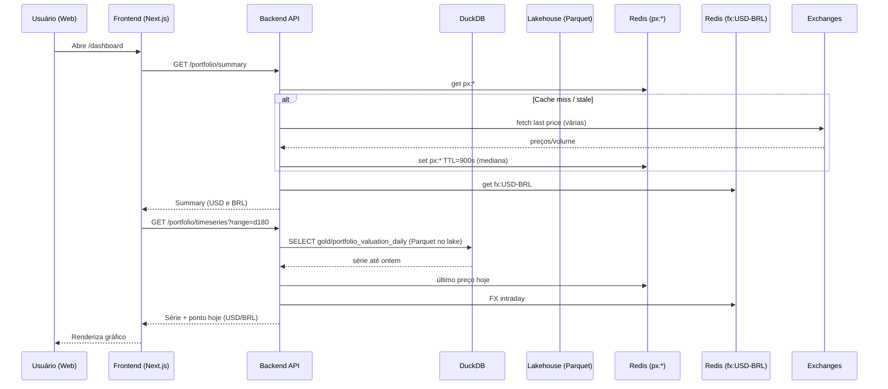
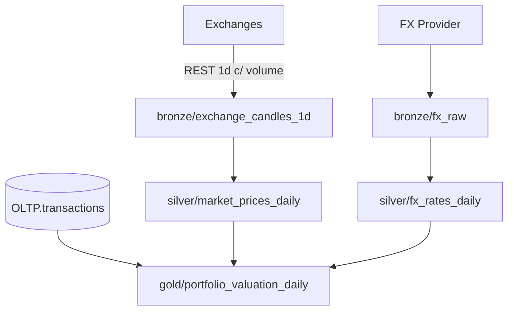

# Plataforma de Finanças — Arquitetura MVP (Cripto)

Este documento consolida a **arquitetura**, **modelo de dados (ERD)**, **fluxos** e a **topologia Lakehouse** (bronze → silver → gold) para o MVP focado em criptoativos. O MVP inclui gráfico de evolução do portfólio ao longo do tempo com filtros (All time, últimos 360/180/30 dias, Ano atual), **preço atual com defasagem ≤ 15 min** e **volume diário**. Também inclui **conversão USD→BRL**.

---

## 1) Visão Geral
- **Frontend**: Next.js (React + TypeScript + Tailwind + Recharts)
- **Backend**: Node.js (NestJS ou Express + TypeScript)
- **OLTP**: PostgreSQL (usuários, autenticação, transações operacionais)
- **Lakehouse (Analytics)**: **MinIO (S3 compatível) + Parquet** com **DuckDB** para consultas
- **Orquestração**: Airflow OSS (DAGs diárias) — gratuito
- **Cache**: **Redis** (preços atuais, TTL 15 min) e **FX USD→BRL** (TTL 1h)
- **Integração de Preços**: Conectores diretos em **exchanges** (Binance, Coinbase, Kraken, OKX) — endpoints públicos, **incluindo volume de negociação**
- **FX (USD→BRL)**: coletar **taxa diária (PTAX)** para conversão e **taxa intraday** gratuita para o “hoje”
- **Observabilidade**: logs estruturados, healthcheck, métricas básicas

---

## 2) Diagrama de Arquitetura (alto nível)
```mermaid
flowchart LR
  subgraph Client[Cliente]
    WEB[Web App (Next.js/React)]
  end

  subgraph API[Backend API (Node.js + TS)]
    AUTH[Auth Controller]
    TX[Transactions Controller]
    PORT[Portfolio Controller]
    PRIC[Prices Service]
    FX[FX Service]
  end

  subgraph OLTP[(PostgreSQL - OLTP)]
    U[(users)]
    S[(user_settings)]
    A[(assets)]
    T[(transactions)]
  end

  subgraph CACHE[Redis]
    RC[(px:* preço atual USD)]
    RX[(fx:USD-BRL)]
  end

  subgraph LAKE[MinIO (S3) — Parquet]
    BZ[/bronze/*/]
    SV[/silver/*/]
    GD[/gold/*/]
  end

  subgraph ETL[Airflow OSS]
    DAG1[[fetch_prices_daily]]
    DAG2[[normalize_prices]]
    DAG3[[aggregate_portfolio]]
    DAGFX1[[fetch_fx_daily]]
    DAGFX2[[normalize_fx]]
  end

  DDB[(DuckDB Engine)]
  EX[Exchanges Públicas\n(Binance/Coinbase/Kraken/OKX …)]
  FXSRC[Provedor FX\n(PTAX diária + intraday grátis)]

  WEB -->|HTTP/JSON| API
  API --> OLTP
  API --> CACHE
  API --> DDB
  DDB --> LAKE

  EX -->|REST 1d c/ volume| DAG1 --> LAKE
  LAKE --> DAG2 --> LAKE --> DAG3 --> LAKE

  PRIC --> RC
  PRIC -->|REST público| EX

  FX --> RX
  FXSRC --> DAGFX1 --> LAKE --> DAGFX2 --> LAKE
```

---

## 3) ERD (Modelo de Dados — OLTP)
*(O Lakehouse é esquematizado por pastas/partições; o ERD abaixo cobre o **OLTP** no Postgres usado pela aplicação. Acrescentamos preferência de moeda e suporte a conversão.)*

```mermaid
erDiagram
  users ||--o{ transactions : "tem"
  assets ||--o{ transactions : "movimenta"
  assets ||--o{ market_prices_daily : "cota"
  exchanges ||--o{ market_prices_daily : "origina"

  users {
    uuid id PK
    varchar email UK
    varchar password_hash
    timestamptz created_at
    timestamptz updated_at
  }

  user_settings {
    uuid user_id PK FK
    varchar base_currency  // 'USD' (default) ou 'BRL'
    timestamptz updated_at
  }

  assets {
    uuid id PK
    varchar symbol UK  // ex: BTC, ETH
    varchar name       // Bitcoin, Ethereum
    varchar type       // crypto (no MVP apenas crypto)
    varchar source_id  // opcional
    timestamptz created_at
    timestamptz updated_at
  }

  exchanges {
    uuid id PK
    varchar name  // ex: Binance, Coinbase, Kraken
    varchar code  // ex: BINANCE, COINBASE
    timestamptz created_at
    timestamptz updated_at
  }

  transactions {
    uuid id PK
    uuid user_id FK
    uuid asset_id FK
    varchar side       // BUY | SELL
    numeric quantity   // quantidade do ativo
    numeric price      // preço unitário na moeda base
    varchar currency   // BRL ou USD (decidir padrão)
    timestamptz traded_at // data/hora da execução
    timestamptz created_at
    timestamptz updated_at
    text notes
  }

  market_prices_daily {
    uuid id PK
    uuid asset_id FK
    uuid exchange_id FK // origem (ou NULL se mediana consolidada)
    varchar source      // 'binance' | 'coinbase' | 'kraken' | 'okx' | 'median'
    varchar market      // ex: BTCUSDT, BTC-USD
    date price_date     // dia (UTC)
    numeric open
    numeric high
    numeric low
    numeric close
    numeric volume      // volume diário padronizado em USD
    varchar volume_ccy  // 'USD' (fixo)
    varchar currency    // USD (padrão); BRL calculado em consulta
    timestamptz created_at
    UNIQUE(asset_id, exchange_id, source, market, price_date)
  }
```

**Observações de modelagem**
- **Volume padronizado em USD**: todas as séries diárias terão `volume` convertido para **USD (QUOTE)**. Para pares em USDT, considerar **USDT ≈ USD**. O campo `volume_ccy` permanece e será fixado como `'USD'` nas tabelas silver/gold.
- **Conversão USD→BRL**: armazenar **apenas USD** nas séries; conversão para BRL ocorre em **query** (usando FX diária no lakehouse) e no **“ponto hoje”** (FX intraday em cache Redis).
- **Sem intraday persistido**: apenas **cache em Redis** com TTL 15 min para o preço “agora”; FX intraday com TTL 1h.
- **Moeda base**: usuário pode escolher USD/BRL em `user_settings`.

---

## 4) Endpoints REST (MVP)
*(Camada de API que lê **OLTP (Postgres)** para transações/usuários, lê **Lakehouse (gold via DuckDB)** para séries históricas e lê **Redis** para preço atual)*

### Auth
- `POST /auth/register` → cria usuário
- `POST /auth/login` → retorna `access_token` e `refresh_token`
- `POST /auth/refresh` → renova `access_token`

### Assets & Exchanges
- `GET /assets` → lista ativos suportados
- `GET /exchanges` → lista exchanges suportadas e mapeamentos de mercado

### Transactions
- `GET /transactions` (query: `asset_id`, `from`, `to`, paginação)
- `POST /transactions` → `{ asset_id, side, quantity, price, currency, traded_at, notes }`
- `PUT /transactions/:id`
- `DELETE /transactions/:id`

### Portfolio
- `GET /portfolio/summary` → posições atuais por ativo (qty líquida, custo médio, valor atual USD/BRL, P&L)
- `GET /portfolio/timeseries?range=all|ytd|d360|d180|d30` → série temporal consolidada (lê **gold**; adiciona **ponto hoje** com preço cacheado)

### Market Data (das exchanges)
- `GET /marketdata/price?symbol=BTC&quote=USD&to=USD|BRL&source=median|binance|coinbase|kraken` → **preço atual** via **cache Redis** (refresh on-demand). Resposta inclui `volume24h` **padronizado em USD** (quando disponível) e conversão para `to`.
- `GET /marketdata/candles?symbol=BTC&quote=USD&interval=1d&from=...&to=...&to=USD|BRL` → dados **diários** com **volume (USD)**; lê do lakehouse e converte moeda conforme `to` usando FX diária.

---

## 5) Fluxo principal — Carregar Dashboard


---

## 6) Política de Atualização de Preços, Volume e FX (Lakehouse)
- **Atual (≤15 min)**: API consulta exchanges → calcula **mediana** de preço (e, quando aplicável, agrega volume 24h informado) → grava **Redis** (TTL 900s). **Não** persiste intraday. Conversão para BRL feita **on-the-fly** com **FX intraday** (cache TTL 1h).
- **Diário (1d)**: Airflow executa DAGs:
  1) `fetch_prices_daily`: baixa candles **1d com volume** → salva **bronze** (Parquet)
  2) `normalize_prices`: dedup/limpeza → escreve **silver/market_prices_daily** (padroniza volume em **USD**)
  3) `fetch_fx_daily`: coleta **FX USD→BRL** diária (PTAX) → **bronze** → `normalize_fx` → **silver.fx_rates_daily**
  4) `aggregate_portfolio`: combina **silver.market_prices_daily** + **fx_rates_daily** + **OLTP.transactions** → **gold.portfolio_valuation_daily** com colunas `total_usd` e `total_brl`



---

## 7) Cálculo — Quantidade Acumulada, Custo Médio, Valor e Conversão
**No OLTP (Postgres)**
- `transactions`: insumos confiáveis (CSV/entrada app). Timezone UTC e validações.

**No Lakehouse (DuckDB sobre Parquet)**
- **positions_current (gold)**: quantidade líquida e custo médio por usuário/ativo.
- **portfolio_valuation_daily (gold)**: valor diário agregando `qty_D × close_USD_D` e campos derivados `total_usd` e `total_brl = total_usd × fx_usdbrl_D`.
- **Ponto de hoje**: preço atual vem do **Redis** em **USD**, e a API converte para BRL usando **FX intraday** (cache Redis) — devolve ambos ou conforme preferência do usuário.

**Volume**
- Guardado diariamente (silver) **já em USD**; exposto nas APIs de candles e pode alimentar indicadores (ex.: média móvel de volume).

**Regras**
- Custo médio: BUY agrega custo e qty; SELL realiza P&L e ajusta qty; custo médio permanece para a qty restante.
- Preço de marcação: mediana entre exchanges (mín. 2 fontes), fallback por prioridade.
- FX diária: PTAX de fechamento; FX intraday: cache (TTL 1h) para conversões em tempo real.

---

## 8) DTOs/Contracts (TypeScript) — exemplo
```ts
// GET /marketdata/price — cache-first; refresh on-demand
export interface MarketPriceQuery {
  symbol: string;   // ex: BTC
  quote: 'USD' | 'USDT';
  to?: 'USD' | 'BRL'; // moeda de exibição
  source?: 'median' | 'binance' | 'coinbase' | 'kraken' | 'okx';
}
export interface MarketPrice {
  symbol: string;
  quote: 'USD' | 'USDT';
  to: 'USD' | 'BRL';
  source: string;          // median | exchange name
  price: string;           // preço em USD
  priceConverted?: string; // preço convertido (se to=BRL)
  fxRate?: string;         // USD→BRL usado
  volume24h?: string;      // volume 24h padronizado em USD
  asOf: string;            // ISO timestamp
  freshnessSeconds: number;
}

// GET /marketdata/candles — 1d com volume e conversão opcional
export interface CandleQuery {
  symbol: string;
  quote: 'USD' | 'USDT';
  interval: '1d';
  from?: string; // ISO
  to?: string;   // ISO
  toCurrency?: 'USD' | 'BRL';
}
export interface Candle {
  date: string; // YYYY-MM-DD (UTC)
  open: string; high: string; low: string; close: string;
  volume?: string;        // em USD
  closeConverted?: string;// se toCurrency=BRL
}

// GET /portfolio/timeseries — lê gold (Parquet) + ponto hoje (Redis)
export interface PortfolioTimeseriesPoint {
  date: string;
  totalUSD: string;
  totalBRL: string;
}
export interface PortfolioTimeseriesResponse {
  range: 'all' | 'ytd' | 'd360' | 'd180' | 'd30';
  points: PortfolioTimeseriesPoint[];
}
```

---

## 9) Lakehouse — Layout de pastas (MinIO / Parquet)
```
/lakehouse
  /bronze
    /exchange_candles_1d/         year=YYYY/month=MM/day=DD/*.parquet
    /fx_raw/                       year=YYYY/month=MM/day=DD/*.json|parquet
    /transactions_raw/             uploaded_at=YYYYMMDD/*.json|csv
  /silver
    /market_prices_daily/          date=YYYY-MM-DD/*.parquet  # inclui volume (USD)
    /fx_rates_daily/               date=YYYY-MM-DD/*.parquet  # USD→BRL (PTAX)
    /transactions/                 loaded_at=YYYYMMDD/*.parquet
  /gold
    /positions_current/            snapshot_date=YYYY-MM-DD/*.parquet
    /portfolio_valuation_daily/    date=YYYY-MM-DD/*.parquet  # total_usd, total_brl
```

---

## 10) Diagrama Completo — Arquitetura Lakehouse
```mermaid
flowchart TB
  subgraph Client[Frontend Next.js]
    UI[Dashboard & Gráficos]
  end

  subgraph API[Backend (NestJS/Express)]
    EP1[/GET /portfolio/timeseries/]
    EP2[/GET /portfolio/summary/]
    EP3[/GET /marketdata/price/]
    EP4[/GET /marketdata/candles/]
    AGG[Aggregation Layer\n(une gold + preço/FX atual)]
    FXS[FX Service]
  end

  subgraph OLTP[(PostgreSQL)]
    USERS[(users)]
    SETTINGS[(user_settings)]
    TRANS[(transactions)]
  end

  subgraph CACHE[Redis]
    R1[(px:* TTL 15m)]
    RFX[(fx:USD-BRL TTL 1h)]
  end

  subgraph LAKE[MinIO (S3) + Parquet]
    BRONZE[/bronze/*/]
    SILVER[/silver/*/]
    GOLD[/gold/*/]
  end

  DDB[(DuckDB Engine)]
  ORCH[Airflow OSS]
  EXCH[Exchanges Públicas]
  FXP[FX Provider]

  UI --> EP1 & EP2 & EP3 & EP4
  EP3 --> R1
  EP3 --> EXCH
  EP4 --> DDB
  AGG --> R1
  AGG --> RFX
  EP1 --> DDB
  EP2 --> DDB
  DDB --> GOLD
  TRANS --> AGG
  SETTINGS --> AGG
  AGG --> EP1 & EP2

  EXCH -->|REST 1d c/ volume| ORCH
  FXP --> ORCH
  ORCH --> BRONZE --> SILVER --> GOLD

  API --> OLTP
```

---

## 11) Roadmap imediato (sem custo)
- [ ] **Docker Compose**: MinIO, Redis, Airflow, API, Web; DuckDB roda embutido
- [ ] DAG `fetch_prices_daily` (REST → bronze/parquet, **inclui volume (USD)**)
- [ ] DAG `normalize_prices` (DuckDB SQL/DBT → silver com volume padronizado em USD)
- [ ] DAG `fetch_fx_daily` + `normalize_fx` (USD→BRL diária)
- [ ] DAG `aggregate_portfolio` (silver + FX + OLTP.transactions → gold com USD e BRL)
- [ ] API `/marketdata/price` com cache 15m (mediana/fallback) e **conversão BRL** via FX intraday (cache 1h)
- [ ] API `/marketdata/candles` com **volume (USD)** e `toCurrency=BRL|USD`
- [ ] Observabilidade: latência por exchange, cache hit/miss, integrity checks de FX
